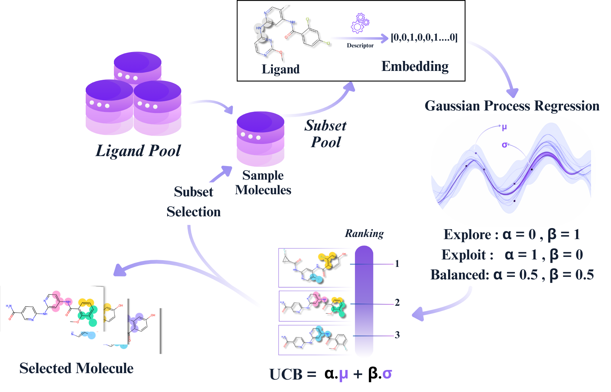

# Explainable Active Learning Framework for Ligand Binding Affinity Prediction

Active learning (AL) prioritises which compounds to measure next for protein–ligand affinity when assay or simulation budgets are limited. We present an explainable AL framework built on Gaussian process regression and assess how molecular representations, covariance kernels, and acquisition policies affect enrichment across four drug-relevant targets. Using recall of top active compounds, we find that dataset identity—the target’s chemical landscape—sets the performance ceiling, while method choices modulate outcomes rather than overturn them. Fingerprints with simple Gaussian process kernels provide robust, low-variance enrichment, whereas learned embeddings with nonlinear kernels can reach higher peaks but with greater variability. Uncertainty-guided acquisition consistently outperforms random selection, yet no single policy is universally optimal; the best choice follows structure-activity relationship (SAR) complexity. To enhance interpretability beyond blackbox selection, we integrate SHapley Additive exPlanations (SHAP) to link high-impact fingerprint bits to chemically meaningful fragments across AL cycles, illustrating how the model’s attention progressively concentrates on SAR-relevant motifs.



🔗 Paper: https://pubs.rsc.org/en/content/articlelanding/2025/dd/d5dd00436e

📦 Zenodo (SHAP results): https://zenodo.org/records/17935028

📝 Our previous work for certain AL design choices can be found at - https://pubs.acs.org/doi/10.1021/acs.jcim.4c00220

---

## 📁 Repository overview

- `explainable_al/` — core Python package (featurisers, GP surrogate, acquisition functions, experiment runner, plotting helpers).
- `apps/` — demo Streamlit apps:
	- `apps/al_app` — interactive active learning GUI (uses `explainable_al`).
	- `apps/shap_app` — SHAP analysis GUI (expects precomputed results from Zenodo or your own runs).
- `data/` — example CSV datasets used by notebooks and tests.
- `notebooks/` — cleaned tutorial notebook `al_notebook.ipynb`.
- `scripts/` — CLI helpers (e.g., `scripts/run_al.py`).
- `tests/` — unit tests for core utilities (keep for CI/regression checks).

---

## 🚀 Quickstart

1) Create a reproducible environment (conda recommended for RDKit):

```bash
conda create -n al python=3.10 -y
conda activate al
conda install -c conda-forge rdkit numpy pandas scikit-learn matplotlib seaborn pytorch jupyter -y
pip install -r requirements.txt
```

```bash
python -m venv .venv
source .venv/bin/activate
pip install -r requirements.txt
```

2) Run the cleaned tutorial notebook:

```bash
jupyter lab notebooks/al_notebook.ipynb
```

3) Run an AL experiment from the terminal (CLI):

```bash
python scripts/run_al.py --dataset data/D2R.csv --representation ecfp \
	--protocol ucb --initial-size 60 --batch-size 30 --cycles 10 --output results/run1
```

4) Launch the demo apps:

```bash
# Active Learning GUI
streamlit run apps/al_app/app.py

# SHAP GUI (point to Zenodo or your outputs)
streamlit run apps/shap_app/shapey.py
```

Notes:
- The SHAP app expects experiment outputs (CSV/NPZ). You can download the paper's results from Zenodo and point the app to that folder.


---

## ⚙️ How to run experiments and customise

- Featurisers: choose `ecfp` (fingerprints), `maccs`, or `chemberta` via the CLI `--representation` flag or in the app UI.
- Acquisition policies: supported policies include `ucb`, `pi`, `ei`, and `random` — select via `--protocol` or the app.
- Surrogate model: experiments currently use Gaussian Process regression; kernel choices can be set in the app.

Examples:

```bash
# Run with MACCS keys and PI acquisition
python scripts/run_al.py --dataset data/D2R.csv --representation maccs --protocol PI --initial-size 60 --batch-size 20 --cycles 12 --output results/pi_run

# Use precomputed ChemBERTa embeddings (place dataset_chemberta.npz alongside the CSV)
python scripts/run_al.py --dataset data/D2R.csv --representation chemberta --output results/chem_run
```

---

## 📝 Citations

If you find the work useful in your research, please cite our paper:

```
@article{srivastava2025explainable,
  title={Explainable Active Learning Framework for Ligand Binding Affinity Prediction},
  author={Srivastava, Satya Pratik and Gorantla, Rohan and Sharath Krishna, Chundru and Winkelman, Claire JR and Mey, Antonia and Singh, Rajeev Kumar},
  journal={bioRxiv},
  pages={2025--12},
  year={2025},
  publisher={Cold Spring Harbor Laboratory}
}
```


<!-- ## 📜 Licence 

See [LICENSE.md](LICENSE.md). -->


## 📫 Contact us

- Satya Pratik Srivastava ([ss864@snu.edu.in](mailto:ss864@snu.edu.in))

- Rohan Gorantla ([gorantlarohan@gmail.com](mailto:gorantlarohan@gmail.com))

- Antonia Mey ([antonia.mey@ed.ac.uk](mailto:antonia.mey@ed.ac.uk))


